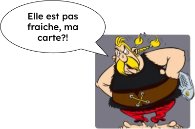

> *"I have connections with Venice
>... I don't know if the University fab lab is still open though."*
> — VULCA Members group, April 2026

Read that again. Someone in a 200+ members network of makers, who personally knows the space they're talking about, has no way to check if it's still open. This isn't a question about effort or connections. It's a question about freshness. And no map in the ecosystem currently answers it.

<figure style="float:right; width:220px; margin:0 0 0.5rem 1.5rem;">
  
  <figcaption style="text-align:right; font-size:0.7rem; color:var(--text-tertiary); margin-top:0.25rem;">Ordralfabétix</figcaption>
</figure>

Sound familiar?

<div style="clear:both;"></div>

Every maker network has a group chat. And every group chat showcase the same recurring questions:

- *"I'm going to be in Bath for a few days, does anyone know labs I could visit?"*
- *"Our Fablab is looking for a space to learn metalwork and welding — we have an Erasmus+ grant."*
- *"Any contacts near Barcelona? I'll be there next week."*
- *"Looking for hosting organizations for an Erasmus+ mobility project — IoT and art focus."*

These are not small talk. These are real, urgent, practical needs. We ran the numbers on one VULCA's group chat over four years — 1,072 messages. The same clusters appear again and again. Grant and consortium partner search is by far the loudest need. Residency brokering follows close behind. Finding a space to visit, checking if a space is still active — these too.

The questions are predictable. And look at what they all have in common: they need a *location*. Where to go. Who to reach near there. Whether a space still exists on a map somewhere. Even when a friend answers, the answer points back to a place — a website, a pin, a contact tied to an address. The map should be answering this. It isn't. So we ask 200 people instead.

<div class="mt-8"></div>


---

## Nobody trusts the maps

There are 15+ directories listing makerspaces, fablabs, hackerspaces, open workshops, and biolabs — European networks, global ones, national initiatives, thematic ones like the Open Flexure Network or GIG. They all exist. Most of us know they exist.

And yet — we still post in the group chat.

Because we've all been burned. You find a space on a map, you reach out, you get no reply or a bounce. You show up, the door is locked. The hours are wrong. The laser cutter listed hasn't been fixed for two years. The space itself closed in 2021.

Fifteen directories. The same intuition — *make the maker ecosystem legible* — built the same way, hitting the same wall. Every one of them asked spaces to come to them: register, create an account, fill a profile. And spaces did. Because there's something real in that act. A new fab lab registers on fablabs.io the same way it sets up a website — not to maintain it, but to *exist*.
> 📣  *Hey, look — we're here.* 🚩👋

That moment of registration is the whole reward.  
But nobody goes back to update. There's no incentive to — the presence is already claimed. And so the data drifts. The map freezes at the moment of signup. The laser cutter gets listed forever.

Meanwhile, each platform sends the same request to the same coordinator — log in, find the field, update it. Not urgent enough to act on. Not ignorable either. A non-priority urgency, arriving from everywhere at once. The kind of weight that doesn't break anything visibly — until someone checks if the Venice fab lab is still open, and nobody knows.

So we stopped trusting the maps. Not consciously, not as a decision — it just happened. The WhatsApp group became the single source of... hope.

---

## The flip: your data, your file

What if it worked the other way?

Instead of pushing your data to fifteen platforms, you publish *one file* — and give us the URL. That's it. A small, structured file that says: here's who we are, where we are, what we do, whether we're open. It can live anywhere online.

Every map, every directory, every bot that cares about your space reads *from you* — not from a copy of a copy of a copy.

You update once. Everyone gets the fresh version. Automatically.

This is the exact same logic behind SpaceAPI, which hackerspace communities have been using for years. Thousands of spaces, one simple endpoint per space. Works beautifully. We want to build on that spirit for the broader maker ecosystem.

---

## What we're asking right now

Concretely: **a public URL** pointing to a structured file about your space. Where it lives is up to you — your website, GitHub, Nextcloud, Google Drive, a VPS, whatever your stack already has. The only condition: the URL is reachable without a login.

It looks something like this:

```json
{
  "name": "FabLab of Ooo",
  "address": "12 Sugar Plum Street, Land of Ooo",
  "website": "https://fablab-of-ooo.example",
  "contact": "hello@fablab-of-ooo.example",
  "status": "open",
  "opening_hours": "Mon–Fri 14:00–20:00",
  "specialties": ["woodworking", "electronics", "candy engineering"],
  "network_memberships": ["VULCA", "Adventure Makers Network"]
}
```
 
That's the minimum.  
We'll run online workshops with RFF (Réseau des Fablabs Français) and VOW (Verbund Offener Werkstätten) to walk through it together — no solo setup required.

**What happens once we include your URL:**

- Your flag on the map goes from ⚪ to 🔵 — confirmed by you, fresh from you
- You can embed a live map view directly on your own website
- Any change you make to your file reflects on the map immediately — no login, no form, no middleman

---

## What this unlocks — progressively

Once enough spaces have a confirmed endpoint, the map stops being a static phonebook. It becomes something you can actually query.

Some questions are answerable from day one, with just the minimal file:

- *"Show me all confirmed open spaces within 100km of Bath"* → yes, from `status` + address geocoding
- *"Which spaces in Germany have woodworking?"* → yes, from `specialties`
- *"Who are the current members of VOW?"* → yes, from `network_memberships`

Others — like finding spaces that have hosted Erasmus+ residencies, or knowing current machine availability — need richer fields. That's a conversation we need to have with the networks, using the real questions from group chats as the guide. Which fields would have answered the most common questions? That's how we design the schema: bottom-up, from actual need.

The minimal file is the foundation. Each field we add together expands what becomes answerable — without adding burden, because it's still just one file you control.

---

## Imagine

A maker in France opens her community platform and posts in the #map-of-making channel: *"Looking for a 5-day metalwork residency in Germany, Erasmus+ funded, June 2026."*

A bot queries the network. Crosses RFF data with VOW data. Finds three matching spaces. Drafts a clear answer with names, contacts, and a small map. Posts it back — in the same channel, in seconds.

No new tab. No external website to navigate. No waiting for 200 people to wake up. The map comes to wherever your community already talks.

That's not science fiction. It's a direct consequence of spaces publishing structured, live, open data. And it's where this is going.

---

## What happens to the group chat

It doesn't go away. It gets better.

Right now, the group chat is doing two jobs at once: it's the warm, human connective tissue of a community *and* the fallback infrastructure for questions a map should answer. When the second job is handled, the first one has room to breathe.

Imagine the same channel, quieter on logistics — and open for the conversations that actually need humans. The weirder collaborations. The harder questions. The ideas that don't fit a form field. The group chat was never the problem. It was the silent warning that the map infrastructure beneath it hadn't arrived yet. Once it does, we get to find out what the community talks about when it stops fielding "are you still open?"

---

## Join us

We're starting with two networks — RFF and VOW — as the first pilot. We want to learn fast, fail small, and build with you, not for you.

If you're a space manager or network coordinator: the first workshops are coming soon through RFF and VOW channels. If you're elsewhere in the world and want in, reach out — the model is designed to extend.

If you're a developer or FLOSS enthusiast who wants to dig into the architecture — linked open data, federated endpoints, the locker as a full sovereignty stack — this is the first in a series. The next articles go into the schema that unlocks consortium matching and residency brokering, then the individual maker layer and how data flows bottom-up by consent. The repo will be public.

The map is broken. We know how to fix it. We just need to build it together.

---

*Maps of Making is a project by [Nicolas de Barquin](https://ndb.nicolasdb.com) (Syntonie ASBL, Brussels) and [Jason Pettiaux](https://jasonpettiaux.be), coordinated from Brussels with letters of intent from 12 organizations across three continents — European networks (RFF France, HTT UK), individual spaces in Spain, Ireland, Croatia, Italy, and Portugal, researchers, and global networks representing 200+ spaces across Africa, Asia, and Latin America (FabCare, GIG, ReFFAO, Internet of Production).*

*This approach builds on [SpaceAPI](https://spaceapi.io/), [W3C Linked Data](https://www.w3.org/standards/semanticweb/data), and [Solid](https://solidproject.org/).*
